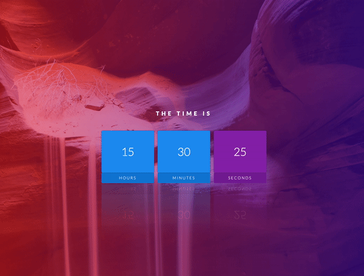

<h3>This project is a simple clock made with HTML, CSS and JS.</h3>

The JS scripting was rather easy and just consisted of 1 function, calling the higher order function Date() within it then calling that function to display the Hours/Minutes/Seconds in each div with a setInterval() for every second. 

The HTML was also very simple - just a few DIVs. However, the CSS was the longest part and I used some neat effects: 

- linear gradient on the background image 
- text transformation
-  -webkit-box-reflect to reflect the clocks time underneath like a puddle
- [nth-child()] (https://developer.mozilla.org/en-US/docs/Web/CSS/:nth-child) to change the colour of the box for the seconds
- Google Fonts
- flexbox
- z-index

and more.

The clock is live [here!](https://zenidith.github.io/digital-clock/)

<h4>Happy coding!</h4>